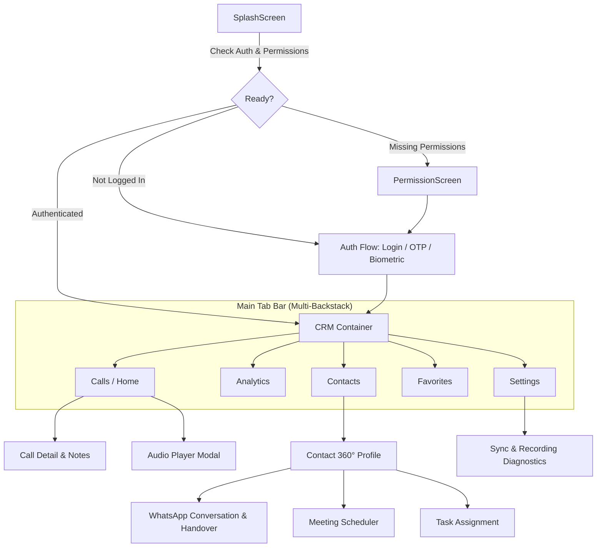

# 🎨 Callog / AllSet CRM — Design System & UI/UX Specification

#design-system #ui-ux #jetpack-compose #material3 #android #callog #allset

---

## 🌟 1. Executive Summary & Design Vision

**Callog (AllSet CRM)** is a high-performance Android application engineered for sales professionals, enterprise consultants, and power users. It unifies system call logs, automated audio recording management, lead/deal pipeline tracking, WhatsApp engagement, and multi-SIM communications into a single, cohesive workflow.

### Core Design Tenets

1. **Editorial Elegance Meets Tactical Utility**: Combining high-trust editorial typography (*EB Garamond*) with crisp, modern geometric sans-serif (*Manrope*) for rapid legibility during fast-paced sales calls.
2. **Glassmorphic Depth & Elevation**: Layered cards with subtle translucent surfaces, 1dp delicate borders, and soft shadows that give the interface a tactile, high-end feel.
3. **Instant Visual Hierarchy**: Color-coded lead status indicators, call direction badges, and SIM routing identifiers allow sales reps to assess context within milliseconds of an incoming or logged call.
4. **Adaptive Light & Dark Modes**: Full dynamic color switching between a calm, paper-inspired light theme (`#F6F7FB`) and an ultra-sleek dark graphite vault theme (`#1F1F1F`).
5. **Zero-Latency Ergonomics**: Thumb-accessible bottom navigation, fluid bottom sheets, quick-action swipe gestures, and compliant 48dp touch targets across all interactive controls.

---

## 🎨 2. Color Palette & Token System

### 2.1 Brand & Semantic Core

| Token Name | Hex Code | Purpose / Application |
|---|---|---|
| `AllSetBlue` | `#4A4FD8` | Primary Brand Color, Active Tab Indicators, Primary Action Buttons |
| `AllSetLavender` | `#B8BCFF` | Secondary Brand Accent, Dark Theme Primary Highlights, Tinted Containers |
| `AllSetTeal` | `#45C79A` | Success / Active State, Connected Audio Player, Upload Complete Badge |
| `AllSetAmber` | `#F4B544` | Warning / Attention, Pending Sync Log, Follow-Up Urgency |
| `Red500` | `#E85C5C` | Error / Missed Calls, High Priority Escalations, Danger Actions |
| `AllSetLightBg` | `#F6F7FB` | Base Canvas Background for Light Theme |
| `AllSetDarkBg` | `#1F1F1F` | Base Canvas Background for Dark Theme |
| `AllSetBorder` | `#D2D5E7` | Border outline for cards, dividers, and light theme input fields |

---

### 2.2 Dynamic Theme Matrix

```text
┌─────────────────────────┬──────────────────────┬──────────────────────┐
│ Token                   │ Light Mode (Hex)     │ Dark Mode (Hex)      │
├─────────────────────────┼──────────────────────┼──────────────────────┤
│ Material.primary        │ #4A4FD8 (Blue)       │ #B8BCFF (Lavender)   │
│ Material.secondary      │ #B8BCFF (Lavender)   │ #4A4FD8 (Blue)       │
│ Material.tertiary       │ #45C79A (Teal)       │ #45C79A (Teal)       │
│ Material.background     │ #F6F7FB (Off-White)  │ #1F1F1F (Dark Charcoal)
│ Material.surface        │ #FFFFFF (Pure White) │ #2A2A2E (Graphite)   │
│ Material.surfaceVariant │ #E8EAF2 (Soft Grey)  │ #313135 (Muted Slate)│
│ Material.outline        │ #D2D5E7 (Light Blue) │ #48484E (Dark Outline│
│ Material.onBackground   │ #1F1F1F (Deep Black) │ #F6F7FB (Off-White)  │
│ Material.onSurface      │ #1F1F1F (Deep Black) │ #F6F7FB (Off-White)  │
│ Material.onSurfaceVariant│ #5E607E (Muted Navy)│ #BBBBCC (Soft Grey)  │
│ GlassSurface            │ rgba(255,255,255,0.5)│ rgba(40,40,40,0.5)   │
└─────────────────────────┴──────────────────────┴──────────────────────┘
```

---

### 2.3 CRM Lead & Deal Status Palette

| Lead Status | Light Fill / Badge | Dark Fill / Badge | Iconography / Meaning |
|---|---|---|---|
| **HOT** | `#FFEBEB` / `#D32F2F` | `#3D1B1B` / `#FF8080` | 🔥 High intent, immediate call-back required |
| **WARM** | `#FFF7E6` / `#D48806` | `#382A12` / `#FFC069` | ☀️ Interested, pending proposal or demo |
| **COLD** | `#F0F5FF` / `#1D39C4` | `#13203D` / `#85A5FF` | ❄️ Low engagement, automated nurture track |
| **FOLLOW_UP** | `#F6FFED` / `#389E0D` | `#162E12` / `#95DE64` | ⏰ Scheduled call or pending action item |
| **CUSTOMER** | `#F9F0FF` / `#722ED1` | `#27143B` / `#D3ADF7` | 💼 Active client, relationship management |
| **VIP** | `#FFF0F6` / `#C41D7F` | `#3D1028` / `#FF85C0` | ⭐ High-value account / Key stakeholder |

---

### 2.4 Call Type Indicators

* 🟢 **Incoming**: `#45C79A` (Teal) — Down-left arrow `Icons.Default.CallReceived`
* 🔵 **Outgoing**: `#4A4FD8` (Blue) — Up-right arrow `Icons.Default.CallMade`
* 🔴 **Missed**: `#E85C5C` (Red) — Curved arrow `Icons.Default.CallMissed`
* ⚪ **Rejected**: `#8E8E93` (Grey) — Slashed call `Icons.Default.CallEnd`

---

## 🔤 3. Typography & Hierarchy

The AllSet design system uses a dual-font strategy through Google Font Provider:

1. **EB Garamond** (Serif): Used for all Displays, Headlines, and Titles to give the CRM a distinguished, high-trust editorial identity.
2. **Manrope** (Geometric Sans): Used for Body, Subtitles, Data Labels, Timestamps, and Navigation items for clean readability.

```text
Type Scale Specifications:
──────────────────────────────────────────────────────────────────────────
Display Large   │ EB Garamond Bold      │ 44sp / 52sp line │ -0.5sp tracking
Display Medium  │ EB Garamond Bold      │ 36sp / 44sp line │  0.0sp tracking
Display Small   │ EB Garamond SemiBold  │ 28sp / 36sp line │  0.0sp tracking
──────────────────────────────────────────────────────────────────────────
Headline Large  │ EB Garamond Bold      │ 32sp / 40sp line │  0.0sp tracking
Headline Medium │ EB Garamond Bold      │ 28sp / 36sp line │  0.0sp tracking
Headline Small  │ EB Garamond SemiBold  │ 24sp / 32sp line │  0.0sp tracking
──────────────────────────────────────────────────────────────────────────
Title Large     │ EB Garamond Bold      │ 22sp / 28sp line │  0.0sp tracking
Title Medium    │ EB Garamond SemiBold  │ 18sp / 24sp line │  0.0sp tracking
Title Small     │ EB Garamond Medium    │ 14sp / 20sp line │  0.0sp tracking
──────────────────────────────────────────────────────────────────────────
Body Large      │ Manrope Regular       │ 16sp / 24sp line │ +0.5sp tracking
Body Medium     │ Manrope Regular       │ 14sp / 20sp line │ +0.25sp tracking
Body Small      │ Manrope Regular       │ 12sp / 16sp line │ +0.4sp tracking
──────────────────────────────────────────────────────────────────────────
Label Large     │ Manrope Medium        │ 14sp / 20sp line │ +0.1sp tracking
Label Medium    │ Manrope Medium        │ 12sp / 16sp line │ +0.5sp tracking
Label Small     │ Manrope Medium        │ 11sp / 16sp line │ +0.5sp tracking
```

---

## 📐 4. Elevation, Radii & Layout Metrics

### 4.1 Corner Radii
* **Subtle (`4.dp`)**: Status chips, SIM badges, badge tags
* **Medium (`8.dp`)**: Action buttons, search bar input textfield, dropdown menus
* **Card (`16.dp`)**: `GlassyCard`, `CallCard`, QuickStats summary tiles
* **Dialog & Sheet (`24.dp` - `28.dp`)**: Modals, Bottom Sheet top corners, Wizards
* **Pill / Circular (`CircleShape`)**: Contact avatars, FAB buttons, Audio Play/Pause

### 4.2 Spacing & Grid System
* **4dp**: Micro gaps between icon and text inside badges
* **8dp**: Inner element spacing within cards
* **12dp**: Compact card vertical padding
* **16dp**: Screen margin gutter (Left/Right edge padding), standard card padding
* **24dp**: Inter-section vertical spacing
* **32dp**: Section headers spacing on Dashboard and Analytics

---

## 🧩 5. Core UI Components

### 5.1 GlassyCard
A surface card featuring theme-aware translucent fill, rounded corners (`16.dp`), and a subtle 1dp outline border (`MaterialTheme.colorScheme.outline.copy(alpha = 0.5f)`).

```kotlin
@Composable
fun GlassyCard(
    modifier: Modifier = Modifier,
    onClick: (() -> Unit)? = null,
    borderWidth: Float = 1f,
    content: @Composable ColumnScope.() -> Unit
)
```

### 5.2 ContactAvatar
Gradient-backed circular avatar displaying the contact photo via Coil or generating two-letter high-contrast initials with a smooth Teal gradient fallback.

### 5.3 SimSlotChip
Visual SIM indicator displaying `SIM 1` / `SIM 2` with carrier branding or slot color, allowing immediate differentiation in dual-SIM business environments.

### 5.4 AudioPlayerBottomSheet
A docked or expandable bottom sheet powered by **Media3 ExoPlayer** featuring:
- Scrubbable audio waveform / linear progress bar
- Play/Pause toggle with spring animation
- Playback speed selector (`1.0x`, `1.25x`, `1.5x`, `2.0x`)
- Jump forward/backward 10-second buttons
- Cloud upload sync state indicator (`Uploaded`, `Uploading`, `Pending`)

### 5.5 BusinessSimWizardDialog
Interactive 3-step setup modal for first-time launch:
1. Detecting installed SIM cards & IMSI
2. Assigning Business SIM vs Personal SIM
3. Enabling automatic call recording directory scan rules

---

## 🧭 6. Information Architecture & Navigation Flow

The app operates on **Jetpack Navigation 3** state-driven architecture with multi-backstack preservation.



---

## 🔔 7. Custom InCallService & Calling UI Experience

When a phone call occurs, the custom overlay evaluates contact CRM metadata:

```text
Incoming Call Detected (Phone State / InCallService)
                      │
        ┌─────────────┴─────────────┐
        ▼                           ▼
[Known CRM Contact]          [Unknown Number]
        │                           │
  Fetch Lead Status           Standard Call Log UI
  (e.g., HOT / VIP)                 │
        │                     "Create Lead" FAB
 ┌──────┴───────────────────────────┐
 ▼                                  ▼
Custom Ringtone (VIP Pitch)   Rich Contact Card Overlay:
                              - Full Name & Organization
                              - Deal Pipeline Value
                              - Last Interaction Summary
                              - 1-Tap Call Recording Trigger
                              - Quick Disposition Notes
```

---

## ⚡ 8. Motion, Animations & Micro-Interactions

| Interaction | Animation Spec | Duration & Easing |
|---|---|---|
| **Tab Switch** | Fade through + Subtle horizontal slide (16dp) | 250ms `FastOutSlowInEasing` |
| **Audio Play/Pause** | Scale bump (`1.0 -> 1.15 -> 1.0`) + Icon crossfade | 200ms `Spring(dampingRatio = 0.6f)` |
| **Card Press** | Surface alpha shift + 1dp elevation compression | 150ms `LinearOutSlowInEasing` |
| **Waveform Playback** | Active amplitude bar height expansion | Realtime Media3 buffer callback |
| **Pull-to-Refresh** | Radial progress with primary blue gradient sweep | 300ms rotation cycle |

---

## ♿ 9. Accessibility & Inclusivity Guidelines

1. **Touch Targets**: All interactive elements (buttons, call icons, navigation tabs) guarantee a minimum touch area of `48.dp x 48.dp`.
2. **Dynamic Font Scaling**: All typography uses SP units and scales fluidly from 85% to 200% system accessibility font size without clipping text.
3. **Contrast Ratios**:
   - Body Text against Surface: Minimum `7:1` (WCAG AAA).
   - Secondary Text against Surface: Minimum `4.5:1` (WCAG AA).
   - Badges & Chips: High contrast foreground-to-container ratio.
4. **TalkBack Semantics**: Every icon button includes a localized `contentDescription` (e.g., `"Call Rahul Sharma"`, `"Play recording from March 3"`, `"Toggle SIM 1 filter"`).

---

## 💻 10. Developer & Compose Guidelines

* **Pure Composable Functions**: Always pass state downwards and event lambdas upwards (`onCallClick: (CallLogEntry) -> Unit`).
* **Theme Enforcement**: Never hardcode colors (like `Color.Black` or `Color(0xFF...)`) inside screen composables. Use `MaterialTheme.colorScheme` or custom tokens from `Color.kt`.
* **Previews**: Every component must provide both `@Preview(name = "Light")` and `@Preview(name = "Dark", uiMode = UI_MODE_NIGHT_YES)` configurations.
